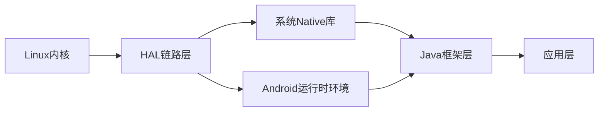

### Android操作系统架构

#### 架构分层

```mermaid
graph LR
	kernel[Linux内核]-->hal[HAL链路层]
	hal-->native[系统Native库]
	hal-->android[Android运行时环境]
	native-->java[Java框架层]
	android-->java
	java-->application[应用层]
```

